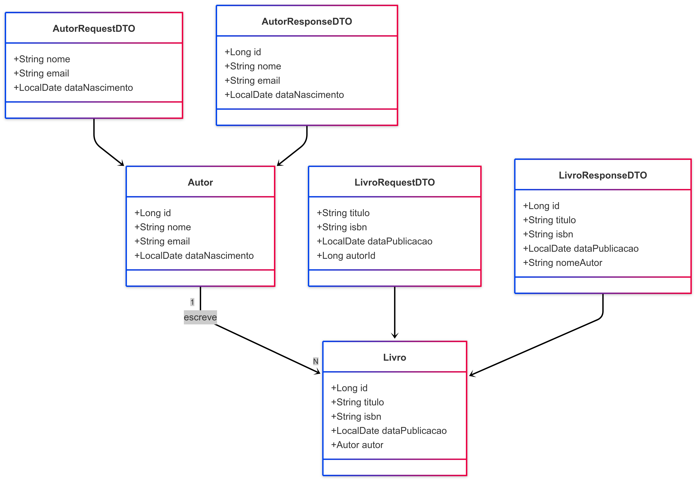

# 📚 API Livraria - Java Spring

Uma API REST desenvolvida em Java com Spring Boot, JPA e banco de dados MySQL para gerenciamento de livros e autores. Permite operações de CRUD, filtros personalizados, paginação, ordenação e validações com Jakarta Validation.

## 🚀 Tecnologias

- Java 17+
- Spring Boot
- Spring Web
- Spring Data JPA
- MySQL
- Jakarta Validation
- Lombok

## 📝 Diagrama

## 🛠 Funcionalidades

- Cadastro, atualização, listagem e remoção de livros e autores
- Filtros personalizados (por nome, título, ISBN etc.)
- Paginação e ordenação
- Validações nos campos de entrada
- Tratamento global de exceções

## 🧪 Testes

Os endpoints podem ser testados via Postman.

## 💡 Autor

Desenvolvido por [Victor da Costa Almada](https://github.com/VictorAlmada)

